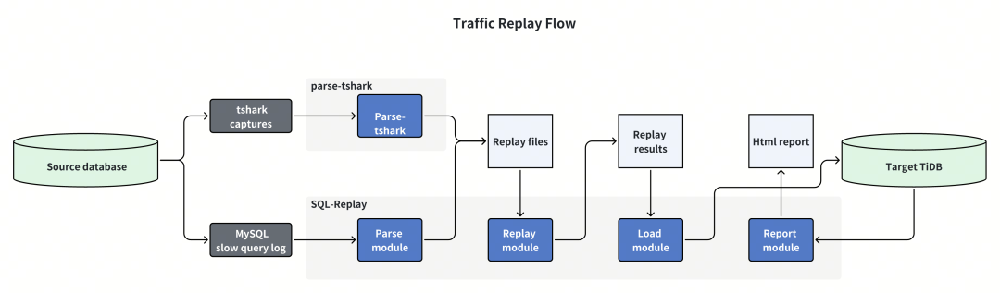

**[中文](https://github.com/Bowen-Tang/sql-replay/blob/main/README_ZH.md) | [English](https://github.com/Bowen-Tang/sql-replay/blob/main/README.md)**

# Introduction


## Scenarios
1. Version upgrade compatibility and performance evaluation
2. System migration compatibility and performance evaluation

## Supported Source Databases
1. MySQL 5.6, 5.7, 8.0
2. Aurora MySQL 5.7/8.0
3. Maybe Other Cloud RDS ...
4. TiDB
5. MariaDB

Examples of MySQL Slow log formats:
```
# Time: 2024-01-19T16:29:48.141142Z
# User@Host: t1[t1] @  [10.2.103.21]  Id:   797
# Query_time: 0.000038  Lock_time: 0.000000 Rows_sent: 1  Rows_examined: 1
SET timestamp=1705681788;
SELECT c FROM sbtest1 WHERE id=250438;
```

```
# Time: 240119 16:29:48
# User@Host: t1[t1] @  [10.2.103.21]  Id:   797
# Query_time: 0.000038  Lock_time: 0.000000 Rows_sent: 1  Rows_examined: 1
SET timestamp=1705681788;
SELECT c FROM sbtest1 WHERE id=250438;
```

```
# Time: 231106  0:06:36
# User@Host: coplo2o[coplo2o] @  [10.0.2.34]  Id: 45827727
# Query_time: 1.066695  Lock_time: 0.000042 Rows_sent: 1  Rows_examined: 7039 Thread_id: 45827727 Schema: db Errno: 0 Killed: 0 Bytes_received: 0 Bytes_sent: 165 Read_first
: 0 Read_last: 0 Read_key: 1 Read_next: 7039 Read_prev: 0 Read_rnd: 0 Read_rnd_next: 0 Sort_merge_passes: 0 Sort_range_count: 0 Sort_rows: 0 Sort_scan_count: 0 Created_tmp_
disk_tables: 0 Created_tmp_tables: 0 Start: 2023-11-06T00:06:35.589701 End: 2023-11-06T00:06:36.656396 Launch_time: 0.000000
# QC_Hit: No  Full_scan: No  Full_join: No  Tmp_table: No  Tmp_table_on_disk: No  Filesort: No  Filesort_on_disk: No
use db;
SET timestamp=1699200395;
SELECT c FROM sbtest1 WHERE id=250438;
```

Examples of MariaDB Slow log formats:
```
# Time: 241003  9:01:42
# User@Host: read1[read1] @ host123 [10.3.11.123]
# Thread_id: 1469315676  Schema: joymeet  QC_hit: No
# Query_time: 0.000835  Lock_time: 0.000009  Rows_sent: 1  Rows_examined: 478
# Rows_affected: 0  Bytes_sent: 0
SET timestamp=1727946102;
select count(*) as aggregate from `stats_history`; 
```

## Parse Section
Reads MySQL slow query logs, removes invalid SQL such as automatically generated "set timestamp=xx/# Administrator/--", and generates a formattable JSON file for replay.

## Replay Section
1. Reads the formatted JSON file generated in the parse stage (or by parse-tshark -mode parse2file from packet capture tool tshark). Can filter upstream database users, upstream SQL types (all, select), and upstream database names (only supports logs collected by packet capture tools) for replay.
2. Parallel execution based on connection id, serial execution for SQL with the same connection id.
3. Outputs replay results to JSON files (separated by connection id).

## Load Section
1. Parses the JSON files generated by replay, uses the TiDB Parse module to format SQL and generate fingerprints (sql digest).
2. Writes the parsed information into the replay_info table in the database.

## Report Section
Analyzes replay results and generates a replay report (including response time comparison and error information).

# Usage Example

## Download and Extract
```
mkdir replay && cd replay && wget https://github.com/Bowen-Tang/sql-replay/releases/download/v0.3.4/v0.3.4.zip
unzip v0.3.4.zip
```

## 1. Parse Slow Query Log
```
# Parse MySQL Slow Log
./sql-replay -mode parsemysqlslow -slow-in /opt/slow.log -slow-out /opt/slow.format
# Parse TiDB Slow Log
./sql-replay -mode parsetidbslow -slow-in /opt/slow.log -slow-out /opt/slow.format
# Parse MariaDB Slow Log
./sql-replay -mode parsemariadbslow -slow-in /opt/slow.log -slow-out /opt/slow.format
```
Note: 
1. /opt/slow.log is the path to the slow query log, slow.format is the output formatted file.
2. TiDB slow logs are split by file. When replaying multiple slow log files, it is recommended to merge the output results into a single replay file in order.

## 2. Connect to Target Database for Replay
```
mkdir out # To store Replay Results
# Replay All users and All SQL type
./sql-replay -mode replay -db 'user:password@tcp(ip:port)/db' -speed 1.0 -slow-out /opt/slow.format -replay-out ./out/sb1_all -username all -sqltype all -dbname all -lang en
# Replay All users and only Select SQL
./sql-replay -mode replay -db 'user:password@tcp(ip:port)/db' -speed 1.0 -slow-out /opt/slow.format -replay-out ./out/sb1_select -username all -sqltype select -dbname db1 -lang zh
```

Note:
1. 'out' is the directory for storing replay results **(can be changed to other directories, needs to be manually created)**. sb1_all/sb1_select is the replay task name; 'speed' is the replay speed. When the slow query cycle is long but there are few statements, it's recommended to increase the replay speed. When simulating higher pressure, it's also recommended to increase the replay speed.
2. In 'user:password@tcp(ip:port)/db', 'db' refers to the target database for replay.
3. Advanced Future: -ignoredigests digest1,digest2,digest3...

## 3. Import Replay Results to Database
**Import data**
```
# Import Replay Results For task sb1_all 
./sql-replay -mode load -db 'user:password@tcp(ip:port)/db' -out-dir ./out -replay-name sb1_all -table replay_info 
# Import Replay Results For task sb1_select 
./sql-replay -mode load -db 'user:password@tcp(ip:port)/db' -out-dir ./out -replay-name sb1_select -table replay_info 
```
Note: -out-dir is the directory for storing replay results, -replay-name is the replay task name, table is the result table to write to.

## 4. Generate Report
```
./sql-replay -mode report -db 'user:password@tcp(ip:port)/db' -replay-name slow1 -port ':8081'
```
Note: After execution, you can access the report content at IP:PORT.

# Report Example


The Replay Summary records the "total SQL execution time comparison", "number of faster SQL statements", "number of slower SQL statements", and "number of erroneous SQL statements".


Note:
1. For ease of display, text content has been abbreviated with ..., but you can still copy the full content by double-clicking and selecting the cell content; additionally, sample_sql_text supports preview.
2. The SQL Error Info is sorted by sql_digest and error_info (first 10 characters).

# Multiple Speed Replay Effects (1x (default), 10x, 50x)


# Replay Basically Follows Original Order
Replay file content


SQL execution order recorded in the database


# How to build

1. Install golang 1.20 or above
2. Download the repo
```
git clone https://github.com/Bowen-Tang/sql-replay
```

3. build

```
    cd sql-replay
    go mod tidy
    go build
```

# Replay Suggestions
1. When there's only one database and one user in the database, use -username all -dbname all for replay.
2. When there are multiple databases and users, it's recommended to start multiple sql-replay processes for parallel replay (otherwise, a large number of SQL errors will occur). Each process corresponds to different -username and -dbname (note that the username and database name in -db should also be consistent).

# Known Issues
1. When replaying through slow queries, since the log doesn't record database information, you can only specify -db all or not specify during replay. Otherwise, replay won't occur. (If you want to filter databases during slow query replay, you can do so by specifying -username and the username and database name in -db to complete the replay of the corresponding database)
2. Replaying SQL with hundreds of thousands of rows like "insert into ... (),(),(),() " may cause the program to crash.
3. In SQL from packet capture replay, if it's a prepared statement with ? placeholders, these SQL statements will execute with errors during replay.
4. The SQL replay order is not exactly the same as the real execution order.
5. The execution time recorded in MySQL slow query logs may be slower than the actual time (e.g., select sleep(10) won't be recorded as 10 seconds, and MySQL 5.7 doesn't include lock waiting time, etc.)
6. Slow query log formats of cloud RDS may vary and might not be supported; MariaDB is not currently supported as connection_id cannot be obtained, will be added later.
7. When there are too many connection_id values (>4096), you may encounter a "too many open files" error during replay. Temporary solution: Before replay, use ulimit -n 1000000
